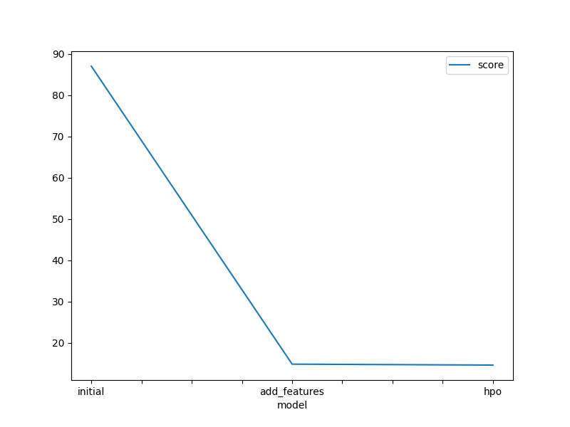
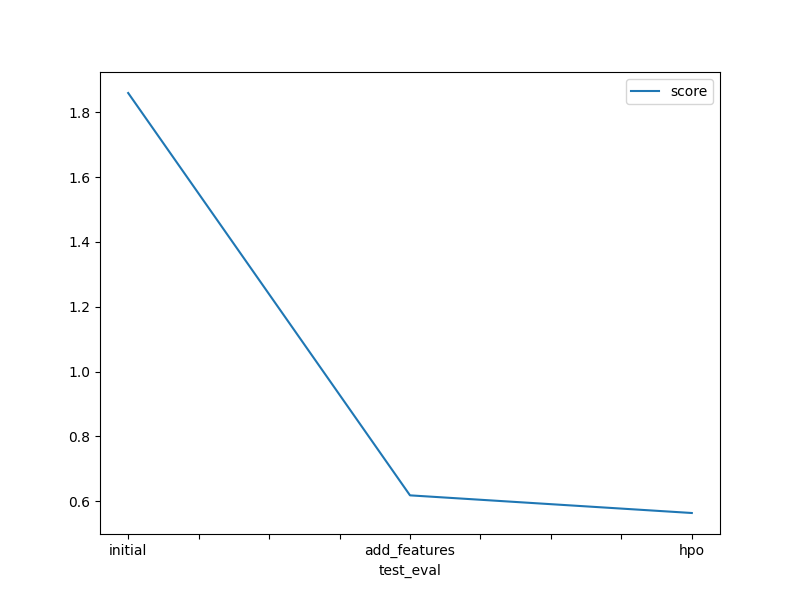

# Report: Predict Bike Sharing Demand with AutoGluon Solution
#### MUGAGGA BENJAMIN

## Initial Training
### What did you realize when you tried to submit your predictions? What changes were needed to the output of the predictor to submit your results?
For predictions that were less than 0, I had to replace those predicions with a zero

### What was the top ranked model that performed?
WeightedEnsemble_L3

## Exploratory data analysis and feature creation
### What did the exploratory analysis find and how did you add additional features?
The histogram plots showed the distribution of each feature relative to the data. This helped in understanding of the range and spread of values for each feature.

Creating additional features from the datetime feature to capture these temporal patterns more explicitly. Specifically, these features were added to represent the hour, day, and month components of the datetime feature.

Making season and weather features categorical also helped in improving the model performance.

### How much better did your model preform after adding additional features and why do you think that is?
After adding these additional features, the model performance improved significantly. The new features provided the model with more granular information about patterns in bike rentals, allowing it to capture variations in demand more effectively. 

## Hyper parameter tuning
### How much better did your model preform after trying different hyper parameters?
There was a slight improvement in the performance seen from the scores obtained from kaggle which provided 0.61846 and 0.56403 for the second model and hpo model respectively.

### If you were given more time with this dataset, where do you think you would spend more time?
I would analyze the importance of different features in predicting bike sharing demand and gain insights into the factors that most strongly influence rental behavior.

Given the temporal nature of the data, I would dive deeper into time series analysis techniques to model and forecast demand more accurately. 

### Create a table with the models you ran, the hyperparameters modified, and the kaggle score.
|model|hpo1|hpo2|hpo3|score|
|--|--|--|--|--|
|initial|87.005073|56.107014|7569.882771|1.85931|
|add_features|14.875099|9.503020|221.268578|0.61846|
|hpo|14.646803|9.567152|214.528848|0.56403|

### Create a line plot showing the top model score for the three (or more) training runs during the project.

### Create a line plot showing the top kaggle score for the three (or more) prediction submissions during the project.

## Summary
Through careful feature engineering and optimization, significant improvements can be achieved in model performance. \
AutoGluon is a good starting point for fitting a dataset onto differnt models and most work can be placed on EDA.